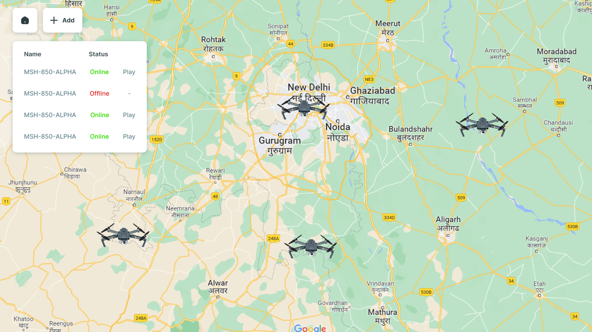
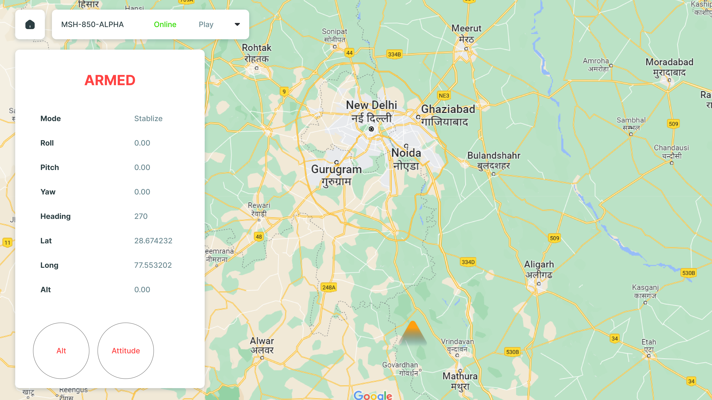
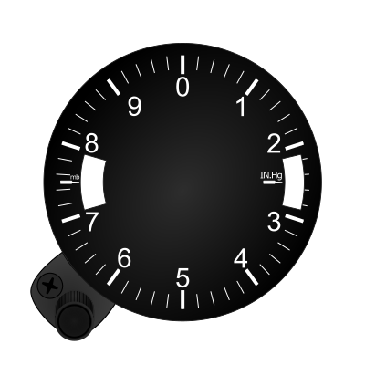
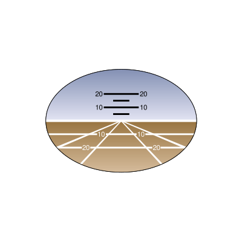

 


Problem Statement
===================
* Create a web application which can connect multiple Drones (acting as a client) using TCP Socket.
* Use the provided API to create multiple instances provided by the API
at-least 5 using Drone class as described in drone_server.py.


### From Web-Application Side:
Create two dashboard pages- 
#### (Dashboard1)
* This dashboard has facility to add or remove drone (via TCP socket)
* On click the online Drones( connected) ,a new dashboard (dashboard2) should open.
* A Google map or any other map that shows online drones on it


#### (Dashboard2):
* This dashboard will show all the data in an interactive manner as described using provided helper frontend library
   and templates or if you wish you can simply display in any way but in proper manner.



You can see two circles are shown which will show altitude and attitude(roll, pitch, yaw) data in the following manner:-

## Alt



## Attitude



For the reference and helper libraries go to [/templates](./templates/)


Understand the Helper Codes and templates
-------------------

### API reference

This consists of Drone class inherits from Network class that creates a drone instance and send it's simulated realtime data.

```python
class Network:
    # IP ADDRESS AND PORT NUMBER OF THE SERVER (MACHINE ON WHICH THIS SCRIPT IS RUNNING)
    def __init__(self, ip, port):
        self.CONNECTION_LIST = []
        self.ip = ip
        self.port = port
        self.server = socket.socket(socket.AF_INET, socket.SOCK_STREAM)
        self.server_address = (self.ip, self.port)
        self.server.bind(self.server_address)
        self.server.listen(10)
        print(bcolors.FAIL + 'SERVER STARTED AT {0}:{1}'.format(self.ip, self.port) + bcolors.ENDC)

        self.CONNECTION_LIST.append(self.server)
        self.client = None

    """ Method to Send JSON Data """

    def send_data(self, d):

        try:
            if self.client.send(d):
                return True
            else:
                return False
        except ConnectionResetError:
            print("CLIENT OFFLINE...")
            self.client = None
            
            
class Drone(Network):
    def __init__(self, ip, port, lat, lon):
        self.sitl = dronekit_sitl.start_default(lat, lon)
        self.connection_string = self.sitl.connection_string()
        print(bcolors.OKGREEN + bcolors.BOLD + ">>>> Connecting with the UAV <<<" + bcolors.ENDC)
        self.vehicle = connect(self.connection_string, wait_ready=True)
        Network.__init__(self, ip, port)

    # return JSON OBJECT CONTAINING DRONE'S REALTIME DATA
    def get_data(self):
        data = dict()
        data['mode'] = self.vehicle.mode.name
        data['roll'] = self.vehicle.attitude.roll
        data['pitch'] = self.vehicle.attitude.pitch
        data['yaw'] = self.vehicle.attitude.yaw
        data['heading'] = self.vehicle.heading
        data['long'] = self.vehicle.location.global_relative_frame.lon
        data['lat'] = self.vehicle.location.global_relative_frame.lon
        data['alt'] = self.vehicle.location.global_relative_frame.alt
        data_send = json.dumps(data)
        return data_send
```
It will send eight parameters to the application in JSON objects
```python
        
        data = dict()
        data['mode'] = self.vehicle.mode.name
        data['roll'] = self.vehicle.attitude.roll
        data['pitch'] = self.vehicle.attitude.pitch
        data['yaw'] = self.vehicle.attitude.yaw
        data['heading'] = self.vehicle.heading
        data['long'] = self.vehicle.location.global_relative_frame.lon
        data['lat'] = self.vehicle.location.global_relative_frame.lat
        data['alt'] = self.vehicle.location.global_relative_frame.alt
       
```


Main Thread
-------------------
This is the main thread named as "drone_server.py" which creates multiple threads as per number of drones to be created
and creates multiple tcp sockets and listening for clients.

```python

from API.SITL_SERVER import *
import _thread as thread


def main():
    """ Main Thread to run multiple drones """
    # Number to instance to be run ( change accordingly )
    instances = 2
    lon,lat = 28.5080152,77.0788194
    # IP address of the system on which this is running ( change accordingly )
    SERVER_IP = '127.0.0.1'
    # Starting port number (always use above 1023 and avoid standard ports)
    Start_port = 5000
    Drones = [None] * instances
    for i in range(instances):
        Drones[i] = Drone(SERVER_IP, Start_port + i,lat+i,lon+i)
        thread.start_new_thread(run_server, (Drones[i],))

    while 1:
        pass


if __name__ == '__main__':
    main()
```

For understanding how data is processed and accessed following two ways are shown:-
- In node Js
```js
// Dummy code snippet to connect server and fetch data
var net = require('net');

var client = new net.Socket();
client.connect(5000, '127.0.0.1', function() {
	console.log('Connected');
	client.write('GET'); // send acknowledge to request data
});

client.on('data', function(data) {
	console.log('Received: ' + data);
	var jsondata = JSON.parse(data);
	console.log(jsondata.mode);
	client.destroy(); // kill client after server's response
});

client.on('close', function() {
	console.log('Connection closed');
});

```

- And in Python:-

```python
import socket
import json
from math import degrees


class bcolors:
    HEADER = '\033[95m'
    OKBLUE = '\033[94m'
    OKCYAN = '\033[96m'
    OKGREEN = '\033[92m'
    WARNING = '\033[93m'
    FAIL = '\033[91m'
    ENDC = '\033[0m'
    BOLD = '\033[1m'
    UNDERLINE = '\033[4m'


host = '127.0.0.1'
port = 5001

# create a socket at client side
# using TCP / IP protocol
s = socket.socket(socket.AF_INET, socket.SOCK_STREAM)
# s = socket.socket(socket.AF_INET, socket.SOCK_DGRAM)

# connect it to server and port
# number on local computer.
s.connect((host, port))

while True:
    try:
        # Send request to receive data
        if s.send('GET'.encode()):
            msg = s.recv(1024)
        else:
            print('Request fails !!!')

        data = msg.decode()
        # JSON formatted data
        data = json.loads(data)
        print(bcolors.OKGREEN + "DATA" + bcolors.FAIL + bcolors.BOLD + str(data) + bcolors.ENDC)

    except KeyboardInterrupt:
        # disconnect the client
        s.close()

```


